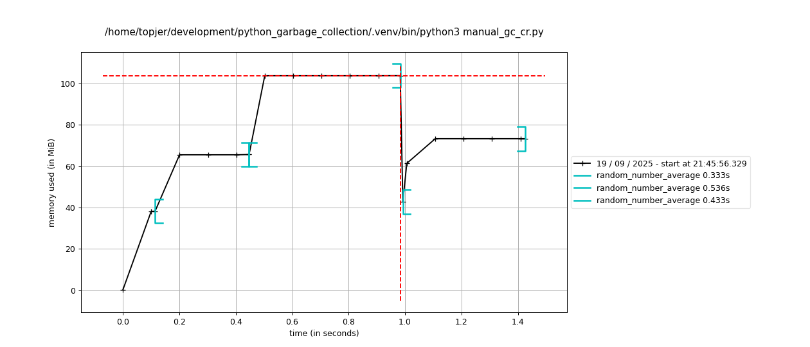

+++
date = '2025-09-17T20:45:48+02:00'
draft = false
title = 'Python garbage collection does not work like you think!'
+++

At least that was the case for me.

While I was learning about profiling of Python applications - make sure to subscribe if you want to read about that - I ended up looking into memory profiling as well.

Having the tools at hand, the following thougt came to mind: "Wouldn't it be cool if I would disable garbage collection and could see a constant increase in memory usage?"

What happened next, surprised me. But, let us start at the beginning.

# What is garbage collection

When it comes to Memory Management (which involves allocation, utilization and deallocation), there are different strategies programming languages employ.

Languages like C and C++ put all responsibility in the hands of the developers. Memory must be allocated and deallocated manually. While this gives fine grained control over memory usage, this can also easily lead to memory leaks or dangling pointers, i.e. references to a memory location that has already been freed.

Other languages like Java or Python take an automated approach. The so-called garbage collector is responsible for identifying and freeing memory once no longer in use.
This makes the life of the developer easier, because they no longer have to concern themselves with manual memory management, but it can lead to unexpected pauses in program execution.

A unique approach is used in Rust. Where a strict set of rules ensures memory safety at compile time.

# How are we going to measure it

First of all, you will need to activate a virtual environment in which you execute the following command:

```
uv pip install memory_profiler numpy matplotlib
```

assuming that you have uv available. If not, I highly recommend you to [install it](https://github.com/astral-sh/uv?tab=readme-ov-file#installation).

Create the following code file:

```Python
# baseline.py
import numpy as np
from time import sleep

# This decorator will be injected by memory_profiler at runtime. We do not need to import it.
@profile
def random_number_average(seconds: float):
    size = round(seconds * 10_000_000)
    arr1 = np.random.randint(low=0, high=100, size=size)
    sleep(seconds)
    return arr1.mean()

def main():
    res1 = random_number_average(0.3)
    res2 = random_number_average(0.5)
    res3 = random_number_average(0.4)
    print(f"Averages: {res1}, {res2}, {res3}")

if __name__ == "__main__":
    main()
```

Now we can memory profile this code via:
```shell
mprof run baseline.py
```

and we should see an image like:


At the beginning of every function, memory usage increases when the array is generated, then stays constant during the period it sleeps and in the end goes done again when the function is left and temporary variables are cleaned up.

Note, how the decrease in memory is still within the brackets of a function call, indicating that the clean up of memory is considered to be part of the function.

# Introducing gc

The whole point of this article is the package gc, which provides and interface to the garbage collector of Python. It especially enables us to disable garbage collection.

Applied to the situation above, this would mean that we no longer see a decrease in memory usage on the graph. It would only continually rise.

We slightly modify the above code to use the `gc` package and disable garbage collection.

```Python
import numpy as np
from time import sleep
import gc

@profile
def random_number_average(seconds: float):
    size = round(seconds * 10_000_000)
    arr1 = np.random.randint(low=0, high=100, size=size)
    sleep(seconds)
    return arr1.mean()

def main():
    gc.disable()
    res1 = random_number_average(0.3)
    res2 = random_number_average(0.5)
    res3 = random_number_average(0.4)
    print(f"Averages: {res1}, {res2}, {res3}")

if __name__ == "__main__":
    main()
```

Profiling the code again will lead to the following situation:


# What is going on?

You should see a picture that is similar to the first one. Maybe the graph looks slightly different and memory usage levels are not the same. This can be due to the timing of the measurements or because memory profiling is not fully deterministic.

Also note how - apparently - the gc package is messing with the brackets in the graph. No idea what is going on here.

But we do not see the continual increase of memory. Why is that? To answer that question, we take a closer look at garbage collection.

# Garbage collection in Python

There are two mechanisms at play when it comes to garbage collection in Python:

* Reference counting
* Circular references

The first one checks how many references to a piece of memory exists and if this count goes to zero, the memory is freed. This is what is happening in our example. Once a function is left, all temporary variables are deleted and thus the underlying memory is freed.

But there is a situation when this is not possible, that is in the case of circular references, e.g. when an object holds a reference to itself or when an object has the reference to another object which has a reference to the first one.

These cases cannot be freed through reference counting and thus a dedicated garbage collector exists for it and this second garbage collector is controlled via the gc package.

# Garbage collection disabled

Check out the following code:
```Python 
import numpy as np
from time import sleep
import gc

@profile
def random_number_average(seconds: float):
    size = round(seconds * 10_000_000)
    arr1 = np.random.randint(low=0, high=100, size=size)
    eternal_list = []
    eternal_list.append(arr1)
    eternal_list.append(eternal_list)
    sleep(seconds)
    return arr1.mean()

def main():
    gc.disable()
    res1 = random_number_average(0.3)
    res2 = random_number_average(0.5)
    res3 = random_number_average(0.4)
    print(f"Averages: {res1}, {res2}, {res3}")

if __name__ == "__main__":
    main()
```

There we create a list that contains our array and also a reference to itself. This is enough to persist the memory allocation even after the function was left.

Run the code and check out the graph.


Here is the picture we wanted to see. The memory usage is constantly increasing. Garbage collection is disabled. So we are done, right?

Well, maybe not! Because the real surprise comes now.

Let's consider the following code where garbage collection is not disabled:

```Python
import numpy as np
from time import sleep

@profile
def random_number_average(seconds: float):
    size = round(seconds * 10_000_000)
    arr1 = np.random.randint(low=0, high=100, size=size)
    eternal_list = []
    eternal_list.append(arr1)
    eternal_list.append(eternal_list)
    sleep(seconds)
    return arr1.mean()

def main():
    res1 = random_number_average(0.3)
    res2 = random_number_average(0.5)
    res3 = random_number_average(0.4)
    print(f"Averages: {res1}, {res2}, {res3}")

if __name__ == "__main__":
    main()
```


We see the same plot - now with brackets again. This means that the circular references are not removed even though garbage collection is on. This implies that the second garbage collector is not constantly running.

# Manual garbage collection

Let's try the opposite from before. We will manually trigger garbage collection before the third function call and check whether we see it on the memory profile.

```Python
import numpy as np
from time import sleep
from timeit import timeit
import gc

@profile
def random_number_average(seconds: float):
    size = round(seconds * 10_000_000)
    arr1 = np.random.randint(low=0, high=100, size=size)
    eternal_list = []
    eternal_list.append(arr1)
    eternal_list.append(eternal_list)
    sleep(seconds)
    return arr1.mean()

def main():
    res1 = random_number_average(0.3)
    res2 = random_number_average(0.5)
    time = timeit(lambda: gc.collect(), number=1)
    res3 = random_number_average(0.4)
    print(f"Averages: {res1}, {res2}, {res3}")
    print(f"Clean up took {time} seconds")

if __name__ == "__main__":
    main()
```



There is an increase in memory from the first to the second run but then a retraction back to the level before the first run.

It also, prints the runtime of the collection run. For me, it roughly took 5 milliseconds. I cannot say for sure whether that is expensive compared to the other garbage collector and thus not done constantly.
